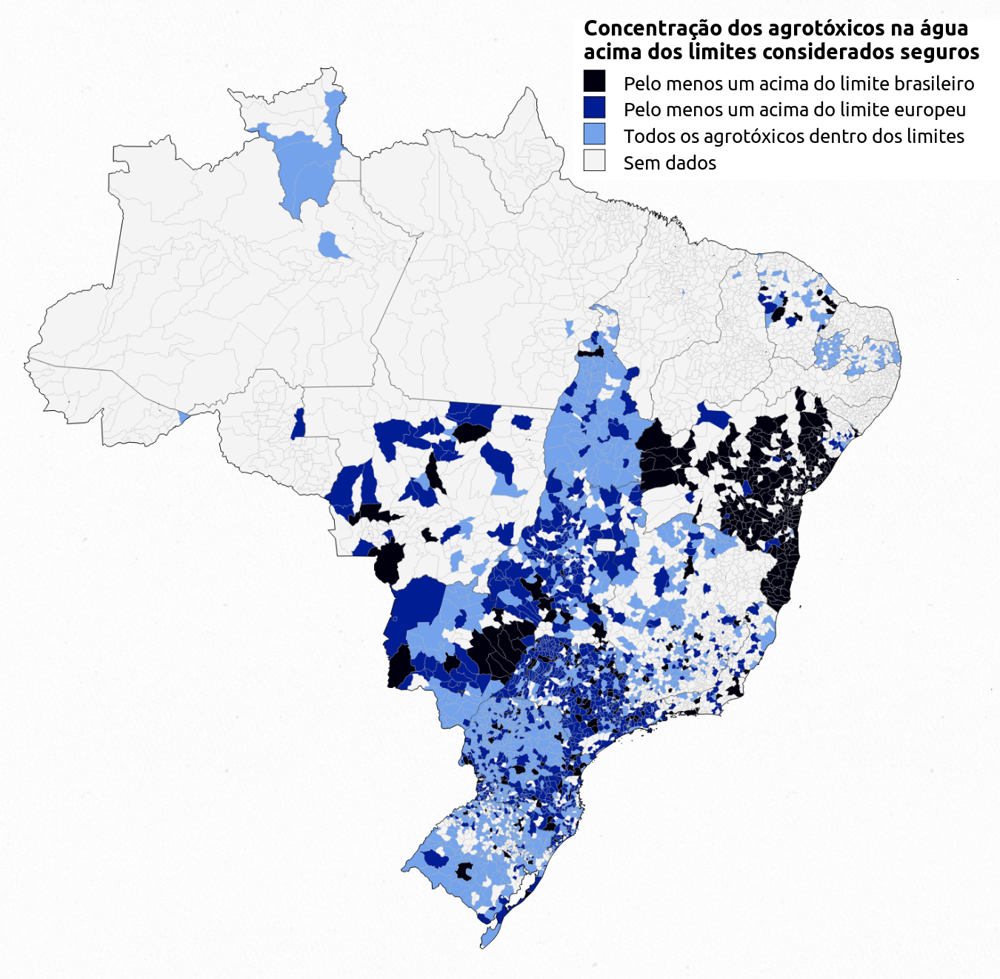

# README

Optimized data of Brazil municipalities borders.

Used in the
[Você bebe agrotóxicos? Descubra se a água da sua torneira foi contaminada](http://portrasdoalimento.info/agrotoxico-na-agua/)
data visualization, on pesticides in Brazil.



## Data

- [data/br-px-topo.json](./data/br-px-topo.json): optimized Brazil geometries
  for municipalities in Brazil.

  ```json
  {
    "type":	"Topology",
    "bbox": {
      "0": 5.684341886080802e-14,
      "1": 47.00178093080447,
      "2": 960,
      "3": 912.9982190691954
    },
    "transform"	: {
      "scale":	[…],
      "translate":	[…]
    },
    "objects": {
      "municipalities": {
        "type":	"GeometryCollection",
        "geometries":	[…]},
      "republic":	{…},
      "federative-units":	{…},
      "internal-federative-units":	{…}
    },
    "arcs":	[…]
  }
  ```

### Municipalities

The data contain the geographic limits of the Brazil municipalities, as defined
by the official Brazilian institute (IPGE), as well as some metadata. For
example, for the Abadia de Goiás municipality:

```
cat data/br-px-topo.json | jq '.objects.municipalities.geometries[0]'
{
  "type": "Polygon",
  "arcs": [
    [
      0,
      1,
      2,
      3,
      4
    ]
  ],
  "properties": {
    "ibgeCode": "520005",
    "fu": "GO",
    "fuCode": "52",
    "name": "Abadia de Goiás",
    "population": "8207"
  }
}
```

with:

- "type": the type of spatial data as defined in
  [topojson](https://github.com/topojson/topojson-specification)
- "arcs": the arcs of the topological data used to define the border (see the
  [topojson specification](https://github.com/topojson/topojson-specification#213-arcs))
- "ibgeCode": municipality identifier given by IBGE
- "fu": two-letter federal unit (state) identifier given by IBGE
- "fuCode": two-number federal unit (state) identifier given by IBGE
- "name": name of the municipality
- "population": estimated population (source IBGE 2018)

### States

To get access to the states data:

```bash
cat data/br-px-topo.json | jq '.objects["federative-units"].geometries[0]'
```

```json
{
  "type": "MultiPolygon",
  "arcs": [
    [
      [
        7417,
        -14108,
        ...
      ],
      [
        15582,
        11956
      ],
      [
        3820,
        17112
      ]
    ]
  ],
  "id": "52",
  "properties": {
    "fu": "GO",
    "fuCode": "52"
  }
}
```

The metadata only include the state identifiers.

Note that the internal borders between states, ie. excluding the national
frontier, are also provided (to be used for graphical purposes) by:

```bash
cat data/br-px-topo.json | jq '.objects["internal-federative-units"].geometries[0]'
```

The national frontier is also available as a MULTIPOLYGON with:

```bash
cat data/br-px-topo.json | jq '.objects["republic"].geometries[0]'
```

## Rebuild the data

To update the [data/br-px-topo.json](./data/br-px-topo.json) file, first install
the required Node.js packages:

```bash
npm install
```

then launch the Makefile

```bash
make all
```

Use `make clean` to remove files.

Alternately, use the npm scripts:

```bash
npm run clean
npm run build
```

## Methodology

The methodology is described in the Makefile comments.

- get and unzip the municipalities spatial data from IBGE ftp (shapefile)
- convert shapefile to GeoJSON
- project GeoJSON to EPSG:5530, so treatments are done in pixels, in a 960x960
  px square, instead of steradians
- convert JSON to ND JSON for easier manipulation
- add IBGE code property
- on another side, convert [inputs/population.csv](./inputs/population.csv) file
  to ND JSON format
- merge population data with spatial data, adding the `ibgeCode`, `fu`,
  `fuCode`, `name` and `population` properties
- convert ND JSON to TopoJSON, with geometries in `municipalities` topology
  object
- simplify the geometry (in order to reduce the size of the file), removing the
  "triangle areas" below 1px² (see
  [Line Simplification](https://bost.ocks.org/mike/simplify/))
- quantize the values, removing useless decimals (in order to reduce the size of
  the file)
- add `republic`, `federative-units` (states) and `internal-federative-units`
  geometries

Technology used:

- npm to install the required packages: [d3-dsv](https://github.com/d3/d3-dsv),
  [d3-geo-projection](https://github.com/d3/d3-geo-projection/),
  [ndjson-cli](https://github.com/mbostock/ndjson-cli),
  [shapefile](https://github.com/mbostock/shapefile) and
  [topojson](https://github.com/topojson/topojson)
- Makefile to coordinate the data building processes

Based on the work by:

- Mike Bostock,
  https://medium.com/@mbostock/command-line-cartography-part-1-897aa8f8ca2c
  parts 1, 2, 3 and 4.
- Carolina Bigonha, https://github.com/carolinabigonha/br-atlas/
- Philippe Rivière, https://observablehq.com/@fil/epsg-5530
- IBGE, ftp://geoftp.ibge.gov.br/organizacao_do_territorio
